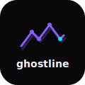

<p align="center">
  
</p>

<h1 align="center">ghostline</h1>

<p align="center">
  <strong>Deterministic replay for AI agents.</strong><br>
  Record once. Replay without tokens. Debug by time-traveling.
</p>

<p align="center">
  <a href="#quick-start">Quick Start</a> ·
  <a href="#why">Why</a> ·
  <a href="#how-it-works">How It Works</a> ·
  <a href="#roadmap">Roadmap</a> ·
  <a href="LICENSE">MIT License</a>
</p>

<p align="center">
  
  
  
  
</p>

---

## Quick Start

```bash
pip install ghostline
```

```python
import ghostline
from anthropic import Anthropic

client = ghostline.wrap(Anthropic())

# Record a run
with ghostline.record("run.ghostline"):
    result = agent.run("analyze this codebase")

# Replay it — zero API calls, zero tokens, bit-for-bit identical
with ghostline.replay("run.ghostline"):
    result = agent.run("analyze this codebase")
```

---

## Why

Every time you re-run an agent to debug, you:
- 💸 **Spend tokens** — same prompt, same cost, different result
- 🎲 **Get nondeterminism** — can't reproduce the exact bug
- ⏱️ **Wait** — full round-trips for every LLM call

Ghostline captures every LLM call in a compact binary format. Replays are instant, deterministic, and free.

> **LangSmith shows you what happened. Ghostline lets you replay it.**

### vs. the alternatives

| | LangSmith | Ghostline |
|:--|:----------|:----------|
| Model | SaaS, closed source | **Open source, self-hosted** |
| Focus | Observability | **Deterministic replay** |
| Debug | Read traces | **Time-travel + branch** |
| Cost | Per trace | **Zero marginal cost** |
| Data | Their cloud | **Your machine** |

---

## How It Works

```
Record                          Replay
──────                          ──────
Agent calls LLM API             Agent calls LLM API
       │                               │
  Ghostline intercepts            Ghostline intercepts
       │                               │
  Forwards to API              Hash-matches request
       │                               │
  Saves response to              Serves cached response
  .ghostline file                from .ghostline file
       │                               │
  Agent continues               Agent continues
  (normal behavior)             (zero network, zero tokens)
```

### `.ghostline` Format

Compact binary — MessagePack frames + zstd compression + O(1) index.

```
[Header: GHSTLINE + version + metadata]
[Frame 0: zstd(msgpack({hash, request, response, latency, timestamp}))]
[Frame 1: ...]
...
[Index: (hash → offset)[] for O(1) lookup]
```

Small files. Fast seeks. No JSON bloat.

---

## CLI

```bash
# Inspect a recorded run
ghostline inspect run.ghostline

# Show detailed frame info
ghostline show run.ghostline --frame 3

# Export to JSON for external tools
ghostline export run.ghostline -o run.json

# Replay deterministically (coming soon)
ghostline replay run.ghostline -- python agent.py
```

---

## Architecture

```
ghostline/
├── crates/
│   ├── ghostline-core/   # Rust: format, writer, reader, frame types
│   └── ghostline-cli/    # Rust: record, replay, export, inspect
├── sdk/                  # Python: httpx wrapper, pip package
├── viewer/               # React: timeline viewer (coming soon)
├── format/               # Binary format spec
└── examples/
```

---

## Roadmap

| Milestone | Status |
|:----------|:-------|
| `.ghostline` binary format + capture engine | ✅ Done |
| Reader + CLI (`inspect`, `show`, `export`) | ✅ Done |
| Replay CLI (`ghostline replay`) | 🔄 In progress |
| Python SDK (`pip install ghostline`) | 🔜 Next |
| Timeline viewer (React) | 🔜 Planned |
| Branching (fork from step N) | 🔜 Planned |

---

## Philosophy

🔒 **Self-hosted** — your traces never leave your machine<br>
💰 **Zero cost replay** — replays don't spend tokens<br>
🦀 **Rust core** — fast capture, small binaries<br>
🐍 **Python SDK** — two-line integration<br>
📖 **Open source, MIT** — no lock-in, no SaaS required

---

## Contributing

Ghostline is early. We welcome contributions — especially around:
- Provider support (OpenAI, LiteLLM, etc.)
- Python SDK ergonomics
- Timeline viewer UX

See [CONTRIBUTING.md](CONTRIBUTING.md) for guidelines.

---

## License

[MIT](LICENSE)
