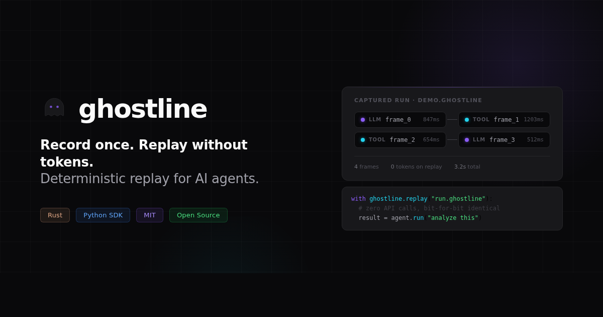
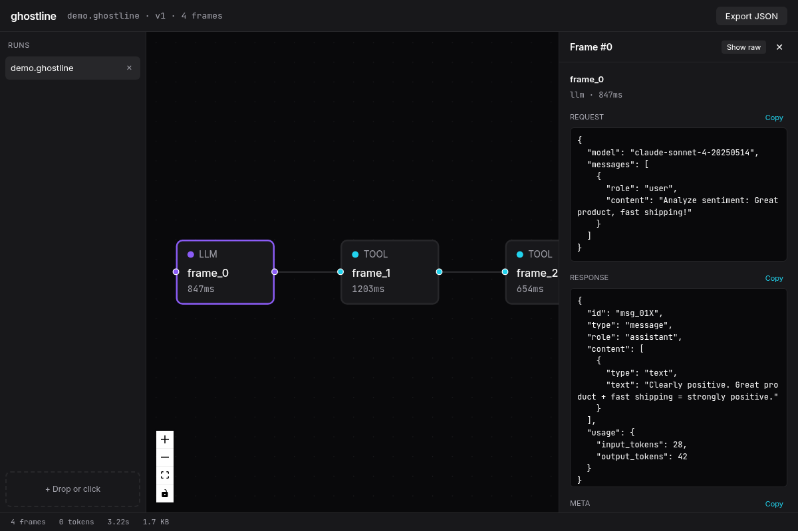

<p align="center">
  
</p>

<h1 align="center">ghostline</h1>

<p align="center">
  <strong>Deterministic replay for AI agents.</strong><br>
  Record once. Replay without tokens. Debug by time-traveling.
</p>

<p align="center">
  <a href="#quick-start">Quick Start</a> ·
  <a href="#proxy-mode">Proxy Mode</a> ·
  <a href="#why">Why</a> ·
  <a href="#how-it-works">How It Works</a> ·
  <a href="#roadmap">Roadmap</a> ·
  <a href="LICENSE">MIT License</a>
</p>

<p align="center">
  
  
  
  
  
</p>

<p align="center">
  
</p>

---

## Viewer

<p align="center">
  
</p>

The viewer shows your agent's execution as a **live node graph**. Purple nodes = LLM calls. Cyan nodes = tool calls. Click any node (or press `j`/`k`) to inspect the full request/response payload, copy it, or time-travel to any step.

---

## Quick Start

### One command. Zero dependencies.

```bash
# Install
curl -fsSL https://ghostline.dev/install.sh | sh
# Or: cargo install ghostline

# Run
ghostline
```

That's it. Ghostline will:
1. Ask for your Claude Code token (first run only)
2. Start a proxy on `http://localhost:9000`
3. Open the live viewer at `http://localhost:5173`
4. Capture all API calls automatically

Then in a new terminal:
```bash
ghostline run claude        # sets ANTHROPIC_BASE_URL automatically
# Or manually:
export ANTHROPIC_BASE_URL=http://localhost:9000
claude
```

All frames appear live in the browser viewer via WebSocket.

---

## Python SDK (Advanced Usage)

For programmatic access, deterministic unit tests, and CI pipelines:

```bash
pip install ghostline
```

```python
import ghostline
from anthropic import Anthropic

client = ghostline.wrap(Anthropic())

# Record a run
with ghostline.record("run.ghostline"):
    result = agent.run("analyze this codebase")

# Replay it — zero API calls, zero tokens, bit-for-bit identical
with ghostline.replay("run.ghostline"):
    result = agent.run("analyze this codebase")
```

---

## Proxy Mode (Zero Code Changes)

Works with **any** LLM client (Claude Code, Cursor, LangChain, LiteLLM, anything).

```bash
# Easiest way — ghostline sets ANTHROPIC_BASE_URL for you
ghostline run claude "analyze this repo"

# Or start proxy separately
ghostline proxy --out ./runs/
ANTHROPIC_BASE_URL=http://localhost:9000 claude "analyze this repo"
```

Zero code changes. Records everything. Replay any run.

---

## Why

Every time you re-run an agent to debug, you:
- 💸 **Spend tokens** — same prompt, same cost, different result
- 🎲 **Get nondeterminism** — can't reproduce the exact bug
- ⏱️ **Wait** — full round-trips for every LLM call

Ghostline captures every LLM call in a compact binary format. Replays are instant, deterministic, and free.

> **LangSmith shows you what happened. Ghostline lets you replay it.**

### vs. the alternatives

| | LangSmith | LangGraph Time Travel | Ghostline |
|:--|:----------|:----------------------|:----------|
| Model | SaaS, closed | LangGraph ecosystem only | **Open source, any framework** |
| Focus | Observability | Replay within LangGraph | **Framework-agnostic replay** |
| Debug | Read traces | Fork checkpoints | **Time-travel + branch** |
| Cost | Per trace | Compute per replay | **Zero marginal cost** |
| Data | Their cloud | Their cloud | **Your machine** |

---

## How It Works

```
Record                          Replay
──────                          ──────
Agent calls LLM API             Agent calls LLM API
       │                               │
  Ghostline intercepts            Ghostline intercepts
       │                               │
  Forwards to API              Hash-matches request
       │                               │
  Saves response to              Serves cached response
  .ghostline file                from .ghostline file
       │                               │
  Agent continues               Agent continues
  (normal behavior)             (zero network, zero tokens)
```

### `.ghostline` Format

Compact binary — MessagePack frames + zstd compression + O(1) index.

```
[Header: GHSTLINE + version + metadata]
[Frame 0: zstd(msgpack({hash, request, response, latency, timestamp}))]
[Frame 1: ...]
...
[Index: (hash → offset)[] for O(1) lookup]
```

Small files. Fast seeks. No JSON bloat. API keys auto-scrubbed before writing.

---

## CLI

```bash
# Inspect a recorded run
ghostline inspect run.ghostline

# Show detailed frame info
ghostline show run.ghostline --frame 3

# Start replay proxy server
ghostline replay run.ghostline

# Start transparent capture proxy
ghostline proxy --out ./runs/

# Export to JSON
ghostline export run.ghostline -o run.json
```

---

## Timeline Viewer

Open any `.ghostline` file in the browser viewer:

```bash
cd viewer && npm run dev
# drag & drop your .ghostline file
```

Features: horizontal timeline, per-frame detail, auto-redacted secrets, keyboard navigation (J/K/Enter/Esc).

---

## Architecture

```
ghostline/
├── crates/
│   ├── ghostline-core/   # Rust: format, writer, reader, frame types
│   └── ghostline-cli/    # Rust: record, replay, proxy, export, inspect
├── sdk/                  # Python: httpx wrapper, pip package
├── viewer/               # React: timeline viewer
├── format/               # Binary format spec (SPEC.md)
└── examples/
```

---

## Roadmap

| Milestone | Status |
|:----------|:-------|
| `.ghostline` binary format + capture engine (Rust) | ✅ Done |
| Reader + CLI (`inspect`, `show`, `export`) | ✅ Done |
| Replay proxy server (`ghostline replay`) | ✅ Done |
| Python SDK (`pip install ghostline`) | ✅ Done — PyPI |
| API key scrubbing (15+ patterns, configurable) | ✅ Done |
| React timeline viewer | ✅ Done |
| Transparent proxy mode (zero code changes) | ✅ Done |
| Branching (fork from step N) | ✅ Done |
| OpenAI + LiteLLM provider support | ✅ Done |
| Vector memory layer (semantic search in replays) | ✅ Done |
| Shareable replay exports (standalone HTML) | ✅ Done |
| Single-binary mode (`ghostline` — embedded viewer + WebSocket) | 🔜 Next |

---

## Philosophy

🔒 **Self-hosted** — your traces never leave your machine<br>
💰 **Zero cost replay** — replays don't spend tokens<br>
🦀 **Rust core** — fast capture, small binaries<br>
🐍 **Python SDK** — two-line integration<br>
🔍 **Auto-scrubbing** — API keys redacted before writing to disk<br>
📖 **Open source, MIT** — no lock-in, no SaaS required

---

## Security

Scrubbing is **enabled by default**. The recorder automatically redacts API keys, tokens, and emails before writing frames to disk. This covers Anthropic, OpenAI, Stripe, AWS, GitHub, and Bearer token patterns.

**Before sharing `.ghostline` files**, verify that no sensitive data remains:
- Custom secrets not covered by built-in patterns should be added via `ScrubConfig.custom_strings`
- Prompts and responses may contain business-sensitive content even after key redaction
- Use `scrub=False` only when you are certain the recording stays local

To report a security issue, email the maintainers directly — do not open a public issue.

---

## Contributing

See [CONTRIBUTING.md](CONTRIBUTING.md). Most wanted:
- Single-binary distribution with embedded viewer
- Additional LLM provider adapters
- Viewer UX improvements (zoom, search, keyboard shortcuts)
- Cross-language SDK ports (Go, TypeScript)

---

## License

[MIT](LICENSE)
